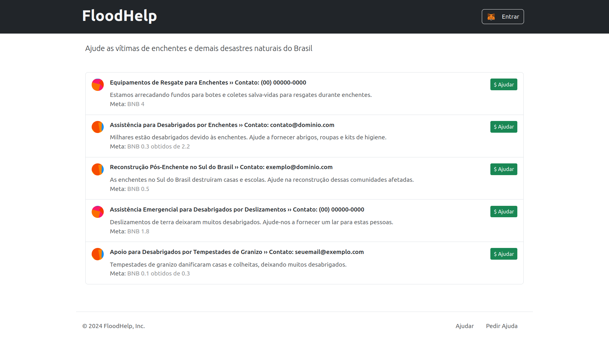
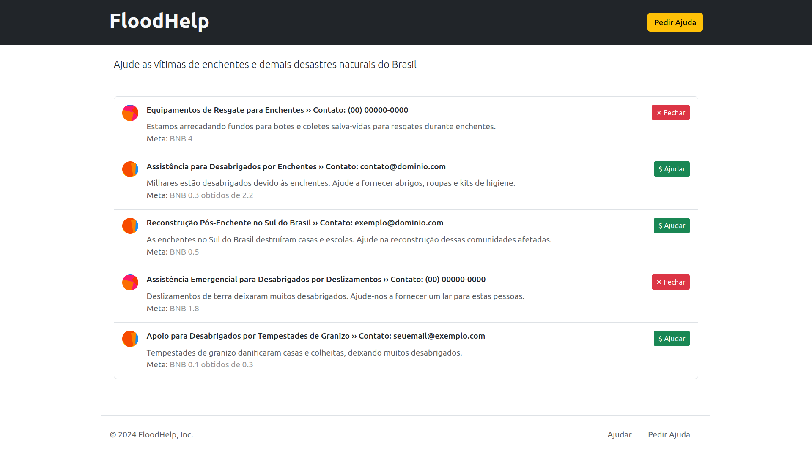
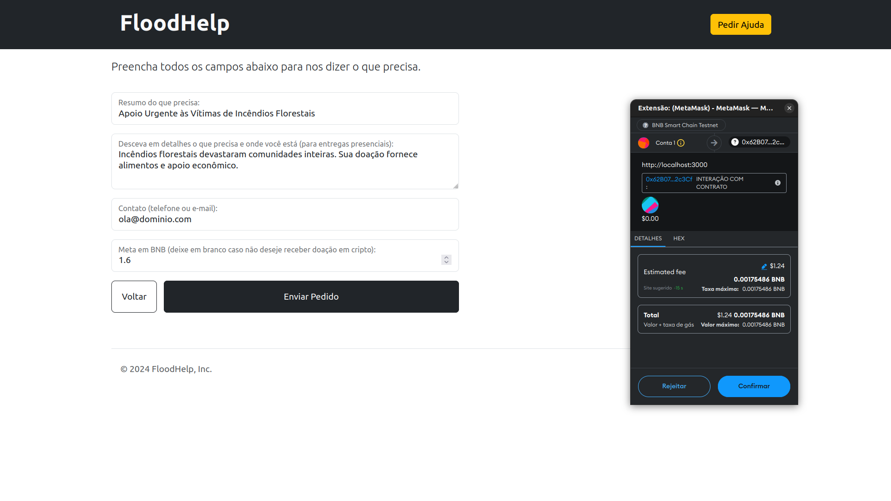

# Web3 Week - FloodHelp

Este repositório contém o código-fonte do projeto `FloodHelp`, desenvolvido durante o evento `Web3 Week`, ministrado pelo Luiz Duarte, mais conhecido como `Luiz Tools` (https://www.luiztools.com.br/).

## Sobre o Projeto

A aplicação visa ajudar vítimas de desastres naturais, permitindo que as pessoas cadastrem pedidos de ajuda e recebam doações em Binance Coin (BNC). Esta aplicação utiliza tecnologias Web3, integrando blockchain para garantir a transparência e a segurança das doações.

## Tecnologias Utilizadas

### Solidity:
Linguagem de programação utilizada para escrever contratos inteligentes em blockchains que seguem o padrão Ethereum. Ela foi utilizada para implementar a lógica de funcionamento da aplicação. https://soliditylang.org/

### BSC Testnet:
Rede de testes para a Binance Smart Chain, permitindo que desenvolvedores testem seus aplicativos de blockchain em um ambiente de teste antes de lançá-los na rede principal. A mesma serviu para testar a aplicação, garantindo que todas as funcionalidades e transações funcionassem corretamente. https://testnet.bscscan.com/

### BNB Faucet:
Serviço que fornece pequenas quantidades de BNB de teste para desenvolvedores utilizarem na BSC Testnet. https://www.bnbchain.org/en/testnet-faucet

### Remix:
É uma IDE online utilizada para desenvolvimento, compilação e teste de contratos inteligentes Ethereum. O contrato FloodHelp.sol foi desenvolvido, compilado e registrado na blockchain de teste da Binance utilizando esta IDE. https://remix.ethereum.org/

### Metamask:
Carteira digital que permite os usuários realizarem transações de forma segura através de uma extensão para o navegador. A autenticação e transações da aplicação FloodHelp são feitas com base na integração desta carteira. https://metamask.io/

### Next.js:
Conhecido por ser um framework de desenvolvimento web front-end React que permite renderização do lado do servidor. Foi com ele que desenvolvemos a interface gráfica responsável pela a criação e visualização dos pedidos. https://nextjs.org/

## Capturas de Tela

### Lista de Pedidos - Com sessão


### Lista de Pedidos - Sem sessão


### Página de Criação de Pedido com a MetaMask Ativa


## Como Executar o Projeto Localmente

Para executar o projeto localmente, siga estas etapas:

### 1. Clone o repositório:
``` bash
git clone https://github.com/leovieira/floodhelp.git
cd floodhelp
```

### 2. Instale as dependências:
``` bash
npm install
```

### 3. Configure o contrato inteligente:
```
1. Carregue o arquivo FloodHelp.sol no Remix
2. Compile o mesmo (CTRL+S)
3. Conecte a sua carteira MetaMask
4. Realize o deploy na rede de teste da Binance
5. Coloque o endereço do contrato no arquivo:
    ./dapp/src/services/Web3Service.js
```

### 4. Inicie a aplicação Next.js:
``` bash
npm run dev
```

### 5. Abra a aplicação em seu navegador:
``` bash
http://localhost:3000
```

## Contribuição

Contribuições são bem-vindas! Sinta-se à vontade para abrir issues e pull requests.

## Licença

Este projeto está licenciado sob a MIT License - veja o arquivo [LICENSE](./LICENSE) para mais detalhes.
